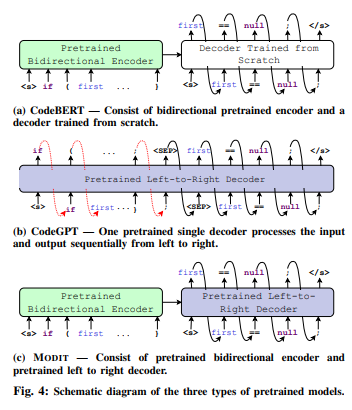
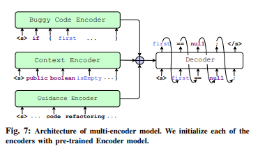
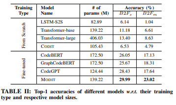
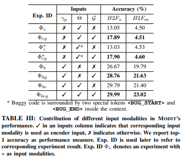
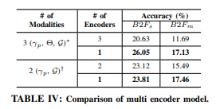

# MODIT: on Multi-mOdal learning of eDITing source code.

This is the official code and data repository for MODIT. 

## Requirements:

1. `python 3.6`
2. `pytorch 1.5.1`
3. `Cuda compilation tools, release 10.1, V10.1.243`

### For Modit:
1. `fairseq==0.9.0`
2. `Apex`

### For Baselines:
1. `transformers==2.6.0`
2. `tokenizers`
3. `tree-sitter`

Auxiliary packages are listed in [`requirements.txt`](requirements.txt). Please make sure all the packages are installed 

### Setup
Run [`setup.sh`](setup.sh) to setup the environment and download pre-processed dataset and models. 

### Experiments

Run [scripts/run-all-experiments.sh](scripts/run-all-experiments.sh) to run the experiments reported in the paper. 

## Results

### RQ1
How MODIT performs in predicting the correct patch?

### RQ2

What  are  the  contribution  of  different  input  modalities in  MODIT’s  performance?

### RQ3 

What is the best strategy to encode input modalities?

### Acknowledgement
A large portion of the code in this repository are borrowed from [PLBART-repository](https://github.com/wasiahmad/PLBART/), [CodeXGlue-repository](https://github.com/microsoft/CodeXGLUE), and [CodeBERT-repository](https://github.com/microsoft/CodeBERT/). We cordially thank theauthors from these repositories to open-source their works. 

